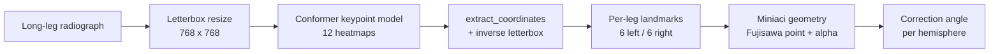

# Conformer HTO

**Automatic measurement of the High Tibial Osteotomy (HTO) correction angle from long-leg radiographs, using a one-stage Conformer keypoint detector.**

This repository regresses surgical anatomical landmarks directly on full-size standing long-leg (hip-to-ankle) radiographs with a single unified [Conformer](https://github.com/nearlyphd/conformer-keypoint-detector) model, then applies the Miniaci geometric construction to compute the planned osteotomy correction angle for both legs. It deliberately removes the intermediate YOLO region-of-interest cropping stage used by earlier two-stage pipelines: one forward pass on the whole radiograph produces every keypoint at once.

> [!WARNING]
> This is a research project for methodological exploration and reproducibility. It is **not** a medical device and must **not** be used for clinical decision-making, diagnosis, or surgical planning.

---

## Background

High Tibial Osteotomy is a joint-preserving surgery that realigns the leg in patients with medial-compartment knee osteoarthritis and varus (bow-legged) deformity. Planning the procedure requires measuring how many degrees the mechanical axis must be rotated so that the weight-bearing line passes through a chosen target on the tibial plateau. That number is the **correction angle**.

Computing it by hand from a radiograph is the standard but laborious workflow: a clinician marks the femoral head, the knee, the ankle, and the intended osteotomy hinge, then constructs the angle. This project trains a model to place those landmarks automatically and reproduces the same geometric measurement, so the correction angle can be derived end-to-end from a raw image.

### The Miniaci / Fujisawa construction

For each leg the model predicts six landmarks, and the angle is built as follows:

- the **ankle centre** is the midpoint of the medial and lateral ankle points;
- the **Fujisawa point** is taken at 62.5% of the tibial-plateau width, measured from the medial knee point toward the lateral knee point — the conventional target for the corrected weight-bearing line;
- a line is drawn from the femoral head through the Fujisawa point and extended down to the horizontal level of the ankle, giving the **target ankle position**;
- the **correction angle α** is the angle at the osteotomy hinge point between the vector to the *current* ankle centre and the vector to the *target* ankle position.

---

## How it works



The model outputs **12 keypoints** — six per leg, indexed as a left hemisphere (slots 0–5) and a right hemisphere (slots 6–11). Hemisphere assignment is relative (smaller mean x → left, larger → right) so it is robust to bounding boxes that straddle the image centre-line.

| Per-leg landmark | Meaning | Source COCO category |
|---|---|---|
| `femur_head` | Centre of the femoral head (hip) | category 1 (1 keypoint) |
| `knee_inner` | Medial tibial-plateau point | category 2 (3 keypoints) |
| `ost_point` | Osteotomy hinge point | category 2 |
| `knee_outer` | Lateral tibial-plateau point | category 2 |
| `ankle_inner` | Medial malleolus | category 3 (2 keypoints) |
| `ankle_outer` | Lateral malleolus | category 3 |

Predictions are made as half-resolution Gaussian heatmaps (one channel per keypoint), passed through a sigmoid and decoded to coordinates, then the letterbox transform is inverted to recover positions in the original image so the geometry is measured at native scale.

---

## Repository layout

```
conformer-hto/
├── notebooks/
│   ├── hto_correction_angles.ipynb         # single end-to-end notebook (train + angle analysis)
│   ├── hto_correction_angles_kfolds.ipynb  # 5-fold CV + final fixed-split training + test analysis
│   ├── hto_interactive_gallery.ipynb       # ipywidgets viewer: specialist labels vs. annotations
│   ├── compute_angle_pairs.py              # inference-only: regenerate (GT, predicted) angle CSVs
│   ├── compute_stats.py                    # agreement statistics from the angle CSVs (CPU-only)
│   └── CKD/                                # git submodule -> conformer-keypoint-detector (models, utils)
├── Dockerfile                              # GPU dev image (PyTorch + timm + JupyterLab)
├── docker-compose.yml                      # one-command GPU container with mounted notebooks/ and data/
├── LICENSE                                 # MIT
└── README.md
```

The `CKD` submodule ([conformer-keypoint-detector](https://github.com/nearlyphd/conformer-keypoint-detector)) provides the model definitions (`Conformer_*_keypoint_half_heatmap`) and the `extract_coordinates` helper. It is a keypoint/heatmap adaptation of the official **Conformer** architecture (Peng et al., *Conformer: Local Features Coupling Global Representations for Visual Recognition*, ICCV 2021), which couples a CNN branch and a transformer branch through a Feature Coupling Unit.

---

## Setup

### 1. Clone with the submodule

The model code lives in a submodule, so clone recursively:

```bash
git clone --recurse-submodules https://github.com/nearlyphd/conformer-hto.git
cd conformer-hto
```

If you already cloned without `--recurse-submodules`:

```bash
git submodule update --init --recursive
```

### 2. Run the environment (Docker)

A GPU-ready image is provided. It is based on the TensorFlow GPU + Jupyter image with PyTorch (CUDA 12.1), `timm`, `ultralytics`, OpenCV, and JupyterLab installed on top.

```bash
docker compose up --build
```

This starts a container with NVIDIA GPU access, mounts `./notebooks` and `./data` into the container, and serves Jupyter on **http://localhost:8888** (no token). Port 22 is also exposed for SSH (the `Dockerfile` expects a `runpod.pub` public key if you deploy on a remote GPU host such as RunPod).

> An NVIDIA GPU with the container toolkit is strongly recommended for training. The two analysis scripts (`compute_angle_pairs.py`, `compute_stats.py`) also run on CPU.

### 3. Data

The dataset is **not** included (`data/` is git-ignored). The notebooks and scripts expect it at:

```
data/hto/xrays/                  # ./data/hto/xrays on the host -> /tf/data/hto/xrays in the container
├── <radiograph images>
├── hto_annotations.json         # COCO-format keypoint annotations (the model's ground truth)
└── specialists_labels.json      # multi-observer landmarks (used by the interactive gallery)
```

Annotations follow the COCO keypoint convention with three categories (femur, knee, ankle) as described above. Ground truth is taken from `hto_annotations.json`; if that file stores the mean-of-three-observers landmarks, the reported errors are measured against the mean observer (matching the predecessor protocol).

---

## Usage

### Train and evaluate

Open either notebook in Jupyter:

- **`hto_correction_angles_kfolds.ipynb`** — the full pipeline: dataset construction and augmentation, model training with masked-heatmap MSE loss, 5-fold cross-validation (with per-fold correction-angle MAE), a final training run on the fixed 80/10/10 split, and the held-out test-set correction-angle analysis with GT-vs-prediction overlays.
- **`hto_correction_angles.ipynb`** — a leaner single-pass version of the same end-to-end flow.

Checkpoints are written as `best_model_global.pt` (final fixed-split model) and `kfolds_models/best_model_fold{1..5}.pt` (one per fold). Model weights are git-ignored.

### Regenerate angles and statistics without retraining

Once checkpoints exist, the angle pairs and agreement statistics can be reproduced cheaply. `compute_angle_pairs.py` runs inference only — no optimisation — reconstructing the exact CV folds and test split via the shared `SEED`, and writes:

```bash
cd notebooks
python compute_angle_pairs.py        # -> angle_pairs_cv.csv, angle_pairs_test.csv
```

`compute_stats.py` then turns those CSVs into the full agreement report (CPU-only, runs in milliseconds):

```bash
python compute_stats.py angle_pairs_cv.csv angle_pairs_test.csv
```

Edit the `CONFIG` block at the top of `compute_angle_pairs.py` to point at your checkpoint and annotation paths. Install `pingouin` (`pip install pingouin`) to get an exact 95% confidence interval on the ICC; otherwise the script falls back to a manual point estimate.

### Inspect annotations

`hto_interactive_gallery.ipynb` renders a side-by-side slider gallery: individual specialists' labels on the left and the consolidated HTO annotations on the right, for visual QA of the landmark data.

---

## Evaluation methodology

Localisation quality is tracked during training with keypoint **MSE** and **PCK** at normalised thresholds of 0.005, 0.01, 0.02 and 0.05. The clinically meaningful endpoint, however, is agreement on the **correction angle**, reported per limb hemisphere as:

- mean / median / std / max **absolute angular error** (degrees) and **RMSE**;
- percentage of cases within a clinical tolerance (default **±1.63°**, after Jiang et al.);
- **ICC(2,1)** — two-way random, absolute agreement, single rater — with a 95% CI, treating the mean-observer ground truth and the automatic method as the two raters;
- **Bland–Altman** bias and 95% limits of agreement;
- **Pearson r**.

For reference, the statistics scripts print the predecessor benchmark from **Przystalski et al. (2023)** (manual reading vs. fully automatic method, same protocol): mean 0.5°, median 0.3°, max 2.76°, ICC 0.99 (0.98–0.99). Reproduce your own numbers with the scripts above rather than citing these as this model's results.

---

## Model variants and key hyperparameters

The Conformer keypoint head is available in four sizes, selectable via `MODEL_VARIANT`:

| Variant | Backbone |
|---|---|
| `tiny` | Conformer-Tiny, patch 16 |
| `small_p16` *(default)* | Conformer-Small, patch 16 |
| `small_p32` | Conformer-Small, patch 32 |
| `base` | Conformer-Base, patch 16 |

Defaults used in the notebooks:

| Setting | Value |
|---|---|
| Input size (`TARGET_SIZE`) | 768 × 768 (letterboxed) |
| Heatmap scale | 0.5 (half resolution) |
| Heatmap Gaussian σ | 6.0 |
| Optimiser | AdamW |
| Learning rate | 2e-4 (`1e-4 × HEATMAP_SCALE/0.25`) |
| LR schedule | Cosine annealing → 1e-6 |
| Epochs | 2000 |
| Batch size | 4 |
| Gradient clipping | max-norm 1.0 |
| Loss | Masked heatmap MSE (visible keypoints only) |
| Seed | 42 |

Training augmentation (applied to the training split only) includes brightness/contrast jitter, Gaussian noise, gamma, CLAHE, sharpening, rotation up to ±10°, vertical shift, and ±10% scale jitter.

---

## Acknowledgements & references

- **Conformer backbone** — Peng et al., *Conformer: Local Features Coupling Global Representations for Visual Recognition*, ICCV 2021. The keypoint adaptation is in the companion repo [conformer-keypoint-detector](https://github.com/nearlyphd/conformer-keypoint-detector), itself built on DeiT, `timm`, and mmdetection.
- **Predecessor / benchmark protocol** — Przystalski et al. (2023), used as the agreement reference in `compute_stats.py`.
- **Clinical tolerance** — Jiang et al., source of the default ±1.63° threshold.
- Surgical geometry follows the **Miniaci** correction-angle method with the **Fujisawa point** target (62.5% of tibial-plateau width).

---

## License

Released under the [MIT License](LICENSE). © 2026 Anton Myshenin.
