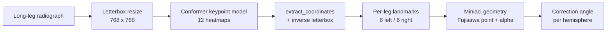

# Conformer HTO

**Automatic measurement of the High Tibial Osteotomy (HTO) correction angle from long-leg radiographs, using a one-stage Conformer keypoint detector.**

This repository regresses surgical anatomical landmarks directly on full-size standing long-leg (hip-to-ankle) radiographs with a single unified [Conformer](https://github.com/nearlyphd/conformer-keypoint-detector) model, then applies the Miniaci geometric construction to compute the planned osteotomy correction angle for both legs. It deliberately removes the intermediate YOLO region-of-interest cropping stage used by earlier two-stage pipelines: one forward pass on the whole radiograph produces every keypoint at once.

Alongside the model, the repo carries the full experimental scaffolding behind the accompanying paper — 5-fold cross-validation with the correction-angle agreement battery computed inline, two Tier-2 architecture ablations, a two-stage cropped-ROI ablation suite that quantifies the error cascade, an inter-specialist agreement analysis, and an external-validation pipeline against the OAI full-limb cohort.

> [!WARNING]
> This is a research project for methodological exploration and reproducibility. It is **not** a medical device and must **not** be used for clinical decision-making, diagnosis, or surgical planning.

---

## Background

High Tibial Osteotomy is a joint-preserving surgery that realigns the leg in patients with medial-compartment knee osteoarthritis and varus (bow-legged) deformity. Planning the procedure requires measuring how many degrees the mechanical axis must be rotated so that the weight-bearing line passes through a chosen target on the tibial plateau. That number is the **correction angle**.

Computing it by hand from a radiograph is the standard but laborious workflow: a clinician marks the femoral head, the knee, the ankle, and the intended osteotomy hinge, then constructs the angle. This project trains a model to place those landmarks automatically and reproduces the same geometric measurement, so the correction angle can be derived end-to-end from a raw image.

### The Miniaci / Fujisawa construction

For each leg the model predicts six landmarks, and the angle is built as follows:

- the **ankle centre** is the midpoint of the medial and lateral ankle points;
- the **Fujisawa point** is taken at 62.5% of the tibial-plateau width, measured from the medial knee point toward the lateral knee point — the conventional target for the corrected weight-bearing line;
- a line is drawn from the femoral head through the Fujisawa point and extended down to the horizontal level of the ankle, giving the **target ankle position**;
- the **correction angle α** is the angle at the osteotomy hinge point between the vector to the *current* ankle centre and the vector to the *target* ankle position.

The mechanical-axis subset of these landmarks (femoral head, knee centre, ankle centre) also defines the **hip-knee-ankle (HKA) angle**, which is what the OAI external validation compares against clinical readings — see [External validation on OAI](#external-validation-on-oai).

---

## How it works



The model outputs **12 keypoints** — six per leg, indexed as a left hemisphere (slots 0–5) and a right hemisphere (slots 6–11). Hemisphere assignment is relative (smaller mean x → left, larger → right), so it is robust to bounding boxes that straddle the image centre-line. *Hemisphere* means **image** left/right; the patient's anatomical side is mirrored.

| Per-leg landmark | Meaning | Source COCO category |
|---|---|---|
| `femur_head` | Centre of the femoral head (hip) | category 1 (1 keypoint) |
| `knee_inner` | Medial tibial-plateau point | category 2 (3 keypoints) |
| `ost_point` | Osteotomy hinge point | category 2 |
| `knee_outer` | Lateral tibial-plateau point | category 2 |
| `ankle_inner` | Medial malleolus | category 3 (2 keypoints) |
| `ankle_outer` | Lateral malleolus | category 3 |

Predictions are made as half-resolution Gaussian heatmaps (one channel per keypoint), passed through a sigmoid and decoded to coordinates with `extract_coordinates` (argmax); the letterbox transform is then inverted to recover positions in the original image so the geometry is measured at native scale.

### Optional: the correction angle as a training signal

The one-stage notebook also ships an **on-graph, differentiable Miniaci layer** (`soft_argmax` → `miniaci_angle` → `angle_loss_from_logits`), the differentiable counterpart of the post-hoc geometry. With it, the correction angle can be optimised directly as a smooth-L1 loss term (masked to fully-annotated hemispheres) on top of the heatmap loss, so the model learns landmarks that are accurate *in the directions that move the angle*.

This is controlled by a single flag: `ANGLE_LOSS_WEIGHT = 0.0` (the committed default) reproduces the heatmap-only baseline; any positive value adds the end-to-end angle objective after an `ANGLE_WARMUP_EPOCHS` heatmap-only warm-up. The angle is computed in network (768 px) space; because the letterbox is a similarity transform (isotropic scale + shift), the angle equals the one in original-image space, so no inverse-letterbox is needed inside the loss. Even at weight 0 the angle is computed and logged every epoch (train/val correction-angle MAE).

---

## Repository layout

```
conformer-hto/
├── notebooks/
│   ├── hto_correction_angles.ipynb                        # ONE-STAGE: train + 5-fold CV + final split
│   │                                                      #   + held-out test + inline agreement battery
│   │                                                      #   + differentiable angle-loss option
│   ├── hto_two_stage_all_experiments.ipynb                # two-stage cropped-ROI ablation suite
│   │                                                      #   (oracle CV, cascade curve, robustness, YOLO)
│   ├── hto_arch_branch_ablation.ipynb                     # Tier-2: dual vs CNN-only vs Transformer-only
│   ├── hto_arch_posembed_ablation.ipynb                   # Tier-2: positional embedding off vs on
│   ├── hto_correction_angles_oai_external_validation.ipynb# external validation on OAI (HKA agreement)
│   ├── hto_interobserver_angle_analysis.ipynb             # inter-specialist correction-angle agreement
│   ├── hto_interactive_gallery.ipynb                      # ipywidgets viewer: specialist labels vs annotations
│   ├── hto_oai_external_validation.csv                    # committed OAI results (per-knee pred vs clinical HKA)
│   └── CKD/                                               # git submodule -> conformer-keypoint-detector
├── scripts/                                               # OAI external-validation data preparation
│   ├── prepare_oai_hka.py                                 # NDA alignment+metadata -> oai_hka_groundtruth.csv
│   ├── filter_oai_fulllimb_images.py                      # restrict image03 manifest to full-limb barcodes
│   ├── build_fulllimb_s3links.py                          # resolve full-limb archives to NDA S3 links
│   └── extract_oai_dicoms.py                              # untar archives -> <barcode>.dcm
├── Dockerfile                                             # GPU dev image (PyTorch + timm + JupyterLab)
├── docker-compose.yml                                     # one-command GPU container, mounts scripts/notebooks/data
├── LICENSE                                                # MIT
└── README.md
```

The `CKD` submodule ([conformer-keypoint-detector](https://github.com/nearlyphd/conformer-keypoint-detector)) provides the model definitions and helpers the notebooks import: `models.py` exposes `ConformerKeypointDetectorHalfHeatmap` and the `Conformer_*_keypoint_half_heatmap` factory functions, and `utils.py` exposes `extract_coordinates`. It is a keypoint/heatmap adaptation of the official **Conformer** architecture (Peng et al., *Conformer: Local Features Coupling Global Representations for Visual Recognition*, ICCV 2021), which couples a CNN branch and a transformer branch through a Feature Coupling Unit, itself built on DeiT, `timm`, and mmdetection.

> [!NOTE]
> The four experiment notebooks (`hto_two_stage_all_experiments`, both `hto_arch_*_ablation`, and the OAI validation) are authored to reuse the one-stage machinery *verbatim* — the same dataset, folds, geometry, and agreement battery — so the only methodological variable in each is the one under test (input type, backbone, positional embedding, or dataset). The ablation notebooks are `nbformat`- and syntax-validated; run them on a GPU host with the data and `CKD` present to produce numbers.

---

## Setup

### 1. Clone with the submodule

The model code lives in a submodule, so clone recursively:

```bash
git clone --recurse-submodules https://github.com/nearlyphd/conformer-hto.git
cd conformer-hto
```

If you already cloned without `--recurse-submodules`:

```bash
git submodule update --init --recursive
```

### 2. Run the environment (Docker)

A GPU-ready image is provided, based on `tensorflow/tensorflow:latest-gpu-jupyter` with PyTorch (CUDA 12.1), `timm`, `ultralytics` (YOLO arm), `opencv-python-headless`, `pydicom` (OAI DICOMs), `pingouin` (exact ICC CI), and the usual `pandas`/`scikit-learn`/`matplotlib`/`seaborn`/`tqdm`/`jupyterlab` stack installed on top.

```bash
docker compose up --build
```

This starts a container with NVIDIA GPU access, mounts `./scripts`, `./notebooks`, and `./data` into the container under `/tf`, and serves Jupyter on **http://localhost:8888** (no token). The image also exposes port 22 and installs an SSH server for remote GPU hosts (e.g. RunPod).

> [!IMPORTANT]
> The `Dockerfile` bakes two host paths into the image at **build** time: `COPY runpod.pub /root/.ssh/authorized_keys` and `COPY data/hto/xrays/ /tf/data/hto/xrays/`. Both must exist at the repo root or the build fails, so before the first `--build`:
> - create a `runpod.pub` SSH public key (e.g. `ssh-keygen -f runpod.pub -N ""`, or copy an existing `*.pub`) — it is git-ignored;
> - ensure `data/hto/xrays/` exists (the compose volume also mounts `./data` at runtime, so the baked copy is just to satisfy the build).

> An NVIDIA GPU with the container toolkit is strongly recommended for training. The CPU-only paths are the inline agreement statistics and the annotation-inspection gallery.

### 3. Data

The dataset is **not** included (`data/` is git-ignored). The notebooks and scripts expect it under `data/`, mounted to `/tf/data` in the container.

**Annotated HTO set** (the model's ground truth and the interobserver/gallery source):

```
data/hto/xrays/                  # ./data/hto/xrays on host  ->  /tf/data/hto/xrays in container
├── <radiograph images>
├── hto_annotations.json         # COCO-format keypoint annotations (12-keypoint ground truth)
└── specialists_labels.json      # per-observer landmarks (interobserver analysis + gallery)
```

Annotations follow the COCO keypoint convention with three categories (femur, knee, ankle) as described above. Ground truth is taken from `hto_annotations.json`; where it stores the mean-of-observers landmarks, reported errors are measured against the mean observer (matching the predecessor protocol).

**OAI external-validation set** (built by the `scripts/`, see [External validation on OAI](#external-validation-on-oai)): the scripts write intermediate manifests and the HKA ground-truth table under `data/hka/`, and the extracted images to a DICOM directory (`<barcode>.dcm`) that the OAI notebook reads via its `OAI_IMAGE_DIR` config.

---

## Usage

### Train, cross-validate, and evaluate — `hto_correction_angles.ipynb`

The one-stage notebook is the full pipeline, top to bottom:

1. dataset construction, letterboxing, and (train-split-only) augmentation;
2. model training with masked-heatmap MSE, tracking keypoint MSE and PCK at four thresholds each epoch, with the optional differentiable angle-loss term;
3. **5-fold cross-validation**, reporting per-fold correction-angle MAE and pooling the per-hemisphere `(GT, predicted)` angles across folds;
4. the **pooled CV agreement battery** (≈107 hemispheres) — the cross-validation column of the paper's Table 1;
5. a **final training run** on the fixed 80/10/10 split;
6. the **held-out test agreement** (12 hemispheres) with GT-vs-prediction overlays, and the combined CV-vs-test Table 1.

Checkpoints are written as `kfolds_models/best_model_global.pt` (final fixed-split model) and `best_model_fold{1..5}.pt` (one per fold). All weights are git-ignored (`*.pt`).

The correction-angle agreement statistics are computed **inline** (`angle_agreement_report`), so no separate post-processing scripts are needed — an earlier `compute_angle_pairs.py` / `compute_stats.py` pair has been folded into the notebook. Install `pingouin` (`pip install pingouin`, already in the image) for the exact 95% CI on the ICC; otherwise a manual ICC(2,1) point estimate is used.

### One-stage vs two-stage, and the error cascade — `hto_two_stage_all_experiments.ipynb`

A companion suite that (a) benchmarks the one-stage model against a two-stage **cropped-ROI** pipeline and (b) substantiates the claim that error cascades from ROI detection into landmark detection. Stage-1 boxes come from an **oracle** (the GT keypoints); a controllable **box jitter** perturbs them to simulate detector error, used both as a training-time robustness augmentation and as the test-time error that drives the cascade. Stage-2 is either **3 region specialists** (`femoral_head`:1ch, `knee`:3ch, `ankle`:2ch) or **1 shared 6-channel model**. The Miniaci geometry, folds, and agreement battery are reused verbatim, so the only variable is the model's input. Four experiments toggle at the top:

1. **Oracle ceiling (5-fold CV)** — 3 specialists vs 1 shared; best case for the two-stage design, with proper *n*.
2. **Cascade dose-response** — angle MAE vs ROI box error, for clean- and jitter-trained specialists.
3. **Robustness CV** *(optional, heavy)* — clean vs robust at one realistic box error, with pooled-CV *n*.
4. **Real YOLO operating point** *(optional, needs `ultralytics`)* — a trained detector anchored on the cascade curve, capturing the missed/duplicate/wrong-leg failures that jitter cannot.

Paste your one-stage CV numbers into `ONE_STAGE_CV` to get the comparison row and the reference line on the cascade plot. Box jitter is a *conservative* detector surrogate (decentred crops, not hard failures), so it lower-bounds the real cascade — the YOLO arm shows the rest.

### Architecture ablations — `hto_arch_branch_ablation.ipynb`, `hto_arch_posembed_ablation.ipynb`

Two controlled Tier-2 ablations built on a shared `AblatableHalfHeatmap` scaffold and an injectable CV harness (`run_kfold_arch`), so every arm shares folds, schedule, training loop, and angle evaluation, and the dual path is a line-for-line copy of the stock forward:

- **branch** — dual (stock Conformer) vs **CNN-only** vs **Transformer-only**, isolating whether the hybrid's dual branch earns its place. Active (trainable, actually-used) parameter counts are reported per arm.
- **posembed** — the dual model with a learnable positional embedding **off vs on**, testing the Conformer paper's claim that the conv branch + FCU coupling make explicit positional embeddings unnecessary (the stock backbone has a `cls_token` but no `pos_embed`).

Both force heatmap-only training (`ANGLE_LOSS_WEIGHT = 0`) so the comparison isolates the architecture, and both print per-fold MAE vectors for a paired test plus mean ± std (a 5-fold paired Wilcoxon is underpowered — read both).

### External validation on OAI

Validates the trained model on out-of-distribution **OAI full-limb radiographs** by comparing the **HKA computed from predicted landmarks** against **OAI's clinical (OAISYS) HKA**. Because HKA uses only the mechanical-axis landmarks (femoral head, knee centre, ankle centre), this externally validates the **alignment backbone** on a large cohort — the osteotomy hinge and plateau-width points stay on the annotated set.

First build the ground truth and fetch the images with the `scripts/` (each script prints its own usage; they target the NDA (NIMH Data Archive) `downloadcmd` workflow that distributes OAI):

```bash
cd scripts
# 1) HKA ground truth from the two NDA exports (Full-Limb only, mean of expert reads, keeps reader SD)
python prepare_oai_hka.py oai_xralign01.txt oai_xrmeta01.txt        # -> oai_hka_groundtruth.csv
# 2) restrict the image manifest to the full-limb barcodes we have HKA for
python filter_oai_fulllimb_images.py image03.txt oai_hka_groundtruth.csv
# 3) resolve those archives to real S3 links, then download with the NDA downloadcmd tool
python build_fulllimb_s3links.py filtered/image03.txt package_file_metadata_<ID>.txt.gz
# 4) untar each full-limb archive to <barcode>.dcm for stem-matching in the notebook
python extract_oai_dicoms.py oai_fulllimb fulllimb_barcode_s3_map.csv oai_dicoms
```

Then set the config cell in `hto_correction_angles_oai_external_validation.ipynb` (`OAI_IMAGE_DIR`, checkpoint, ground-truth CSV) and run top-to-bottom. **Read the laterality/sign diagnostic at the end and fix `IMAGE_LEFT_IS_SIDE` / `HKA_SIGN_FLIP` before trusting the numbers** — the final overlay cell shows exactly what the model is seeing on the preprocessed 768 input. On the OAI full-limb subset the ground truth is HKA signed with 0 = neutral, with an OAI inter-reader SD ≈ 0.30° that serves as the benchmark to approach. A committed `hto_oai_external_validation.csv` (columns `barcode, side, pred_hka, oai_hka, abs_err, flagged`) holds the per-knee output from a completed run for reference.

### Inter-specialist agreement — `hto_interobserver_angle_analysis.ipynb`

Computes the Miniaci correction angle for every image, every leg, and each of the three specialists directly from their annotated landmarks, then quantifies pairwise agreement — per-pair mean/std/max angular error, signed bias, 95% limits of agreement — plus the 3-rater ICC. This establishes the human inter-observer band the automatic method is measured against.

### Inspect annotations — `hto_interactive_gallery.ipynb`

Renders a side-by-side slider gallery: individual specialists' labels (`specialists_labels.json`) against the consolidated HTO annotations (`hto_annotations.json`), for visual QA of the landmark data.

---

## Evaluation methodology

Localisation quality is tracked during training with keypoint **MSE** and **PCK** at normalised thresholds of 0.005, 0.01, 0.02, and 0.05. The clinically meaningful endpoint, however, is agreement on the **correction angle**, reported per limb hemisphere by `angle_agreement_report` as:

- mean / median / std / min / max **absolute angular error** (degrees) and **RMSE**;
- percentage of cases within a clinical tolerance (default **±1.63°**, after Jiang et al.);
- **ICC(2,1)** — two-way random, absolute agreement, single rater — with a 95% CI, treating the mean-observer ground truth and the automatic method as the two raters;
- **Bland–Altman** bias and 95% limits of agreement;
- **Pearson r**.

The same battery is applied to the pooled cross-validation set and the held-out test set (the two Table 1 columns), and, in HKA form, to the OAI cohort. Two empirical references frame the numbers: the project's own **inter-specialist agreement** (from `hto_interobserver_angle_analysis.ipynb`) and, for external validation, the **OAI inter-reader SD ≈ 0.30°**. For continuity with prior work, `angle_agreement_report` also prints the Przystalski et al. (2023) manual-vs-automatic benchmark (mean 0.5°, median 0.3°, max 2.76°, ICC 0.99); treat that as a literature reference, not this model's result — reproduce this model's numbers by running the notebooks on your data.

---

## Model variants and key hyperparameters

The Conformer keypoint head is available in four sizes, selectable via `MODEL_VARIANT`:

| Variant | Backbone |
|---|---|
| `tiny` | Conformer-Tiny, patch 16 |
| `small_p16` *(default)* | Conformer-Small, patch 16 |
| `small_p32` | Conformer-Small, patch 32 |
| `base` | Conformer-Base, patch 16 |

Defaults used in the notebooks:

| Setting | Value |
|---|---|
| Input size (`TARGET_SIZE`) | 768 × 768 (letterboxed) |
| Heatmap scale | 0.5 (half resolution) |
| Heatmap Gaussian σ | 6.0 |
| Optimiser | AdamW |
| Learning rate | 2e-4 (`1e-4 × HEATMAP_SCALE / 0.25`) |
| LR schedule | Cosine annealing → 1e-6 |
| Epochs | 2000 |
| Batch size | 4 |
| Gradient clipping | max-norm 1.0 |
| Loss | Masked heatmap MSE (visible keypoints only) |
| Seed | 42 |

Training augmentation (applied to the training split only, via **torchvision** transforms + **OpenCV** — not Albumentations) includes brightness/contrast jitter, Gaussian noise, gamma, CLAHE, sharpening, rotation up to ±10°, vertical shift, and ±10% scale jitter.

Optional differentiable angle-loss knobs (in `hto_correction_angles.ipynb`):

| Setting | Default | Meaning |
|---|---|---|
| `ANGLE_LOSS_WEIGHT` | `0.0` | 0 = heatmap-only baseline; > 0 adds the end-to-end correction-angle loss |
| `ANGLE_WARMUP_EPOCHS` | `300` | heatmap-only warm-up before the angle term ramps in |
| `SIGNED_ANGLE` | `False` | unsigned magnitude (matches the post-hoc geometry) vs signed (opening/closing) |
| `SOFTARGMAX_BETA` | `5.0` | spatial-softmax temperature for the differentiable decode |
| `FUJISAWA_RATIO` | `0.625` | weight-bearing target along the plateau (medial → lateral) |

---

## Acknowledgements & references

- **Conformer backbone** — Peng et al., *Conformer: Local Features Coupling Global Representations for Visual Recognition*, ICCV 2021. The keypoint adaptation is in the companion repo [conformer-keypoint-detector](https://github.com/nearlyphd/conformer-keypoint-detector), itself built on DeiT, `timm`, and mmdetection.
- **Predecessor / benchmark protocol** — Przystalski et al. (2023), used as the agreement reference printed by `angle_agreement_report`.
- **Clinical tolerance** — Jiang et al., source of the default ±1.63° threshold.
- **External-validation cohort** — the Osteoarthritis Initiative (OAI) full-limb radiographs and OAISYS HKA readings, accessed via the NDA (NIMH Data Archive) download workflow.
- Surgical geometry follows the **Miniaci** correction-angle method with the **Fujisawa point** target (62.5% of tibial-plateau width).

---

## License

Released under the [MIT License](LICENSE). © 2026 Anton Myshenin.
