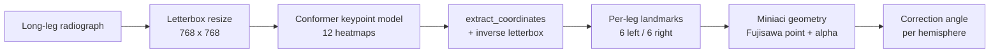

# Conformer HTO

[](https://doi.org/10.5281/zenodo.22922511)


**Automatic measurement of the High Tibial Osteotomy (HTO) correction angle from long-leg radiographs, using a one-stage Conformer keypoint detector.**

This repository regresses surgical anatomical landmarks directly on full-size standing long-leg (hip-to-ankle) radiographs with a single unified [Conformer](https://github.com/nearlyphd/conformer-keypoint-detector) model, then applies the Miniaci geometric construction to compute the planned osteotomy correction angle for both legs. It deliberately removes the intermediate YOLO region-of-interest cropping stage used by earlier two-stage pipelines: one forward pass on the whole radiograph produces every keypoint at once.

Alongside the model, the repo carries the full experimental scaffolding behind the accompanying paper — 5-fold cross-validation with the correction-angle agreement battery computed inline, two Tier-2 architecture ablations, a two-stage cropped-ROI ablation suite that quantifies the error cascade, an inter-specialist agreement analysis, and an external-validation pipeline against the OAI full-limb cohort.

Two later layers sit on top of that. A **reproducibility layer** regenerates every model-dependent number and figure in the manuscript from six archived checkpoints, with no training, and ties each result to the **SHA-256 of the weights that produced it**. An **external-validation deep dive** takes the OAI result apart: across all six checkpoints (how much of the score is the recipe and how much is one training run), by coronal deformity stratum (where the model is measuring and where it is extrapolating), against the measured alignment range of the training set, and case by case through banded error galleries. The outputs of those runs — tables, figures and per-knee CSVs — are committed, so the numbers can be read without a GPU.

> [!WARNING]
> This is a research project for methodological exploration and reproducibility. It is **not** a medical device and must **not** be used for clinical decision-making, diagnosis, or surgical planning.

---

## Background

High Tibial Osteotomy is a joint-preserving surgery that realigns the leg in patients with medial-compartment knee osteoarthritis and varus (bow-legged) deformity. Planning the procedure requires measuring how many degrees the mechanical axis must be rotated so that the weight-bearing line passes through a chosen target on the tibial plateau. That number is the **correction angle**.

Computing it by hand from a radiograph is the standard but laborious workflow: a clinician marks the femoral head, the knee, the ankle, and the intended osteotomy hinge, then constructs the angle. This project trains a model to place those landmarks automatically and reproduces the same geometric measurement, so the correction angle can be derived end-to-end from a raw image.

### The Miniaci / Fujisawa construction

For each leg the model predicts six landmarks, and the angle is built as follows:

- the **ankle centre** is the midpoint of the medial and lateral ankle points;
- the **Fujisawa point** is taken at 62.5% of the tibial-plateau width, measured from the medial knee point toward the lateral knee point — the conventional target for the corrected weight-bearing line;
- a line is drawn from the femoral head through the Fujisawa point and extended down to the horizontal level of the ankle, giving the **target ankle position**;
- the **correction angle α** is the angle at the osteotomy hinge point between the vector to the *current* ankle centre and the vector to the *target* ankle position.

The mechanical-axis subset of these landmarks (femoral head, knee centre, ankle centre) also defines the **hip-knee-ankle (HKA) angle**, which is what the OAI external validation compares against clinical readings — see [External validation on OAI](#external-validation-on-oai).

---

## How it works


```mermaid
flowchart LR
    A[Long-leg radiograph] --> B[Letterbox resize<br/>768 x 768]
    B --> C[Conformer keypoint model<br/>12 heatmaps]
    C --> D[extract_coordinates<br/>+ inverse letterbox]
    D --> E[Per-leg landmarks<br/>6 left / 6 right]
    E --> F[Miniaci geometry<br/>Fujisawa point + alpha]
    F --> G[Correction angle<br/>per hemisphere]
```

The model outputs **12 keypoints** — six per leg, indexed as a left hemisphere (slots 0–5) and a right hemisphere (slots 6–11). Hemisphere assignment is relative (smaller mean x → left, larger → right), so it is robust to bounding boxes that straddle the image centre-line. *Hemisphere* means **image** left/right; the patient's anatomical side is mirrored.

| Per-leg landmark | Meaning | Source COCO category |
|---|---|---|
| `femur_head` | Centre of the femoral head (hip) | category 1 (1 keypoint) |
| `knee_inner` | Medial tibial-plateau point | category 2 (3 keypoints) |
| `ost_point` | Osteotomy hinge point | category 2 |
| `knee_outer` | Lateral tibial-plateau point | category 2 |
| `ankle_inner` | Medial malleolus | category 3 (2 keypoints) |
| `ankle_outer` | Lateral malleolus | category 3 |

Predictions are made as half-resolution Gaussian heatmaps (one channel per keypoint), passed through a sigmoid and decoded to coordinates with `extract_coordinates` (argmax); the letterbox transform is then inverted to recover positions in the original image so the geometry is measured at native scale.

### Optional: the correction angle as a training signal

The one-stage notebook also ships an **on-graph, differentiable Miniaci layer** (`soft_argmax` → `miniaci_angle` → `angle_loss_from_logits`), the differentiable counterpart of the post-hoc geometry. With it, the correction angle can be optimised directly as a smooth-L1 loss term (masked to fully-annotated hemispheres) on top of the heatmap loss, so the model learns landmarks that are accurate *in the directions that move the angle*.

This is controlled by a single flag: `ANGLE_LOSS_WEIGHT = 0.0` (the committed default) reproduces the heatmap-only baseline; any positive value adds the end-to-end angle objective after an `ANGLE_WARMUP_EPOCHS` heatmap-only warm-up. The angle is computed in network (768 px) space; because the letterbox is a similarity transform (isotropic scale + shift), the angle equals the one in original-image space, so no inverse-letterbox is needed inside the loss. Even at weight 0 the angle is computed and logged every epoch (train/val correction-angle MAE).

---

## Repository layout

```
conformer-hto/
├── notebooks/
│   ├── hto_correction_angles.ipynb                          # ONE-STAGE: train + 5-fold CV + final split
│   │                                                        #   + held-out test + inline agreement battery
│   │                                                        #   + differentiable angle-loss option
│   ├── hto_paper_results_from_hashed_weights.ipynb          # regenerate Tables 1-2 / Figs 1-5 from archived
│   │                                                        #   checkpoints, no training      -> paper_results/
│   ├── hto_global_model_test_evaluation.ipynb               # score one hashed checkpoint on the held-out
│   │                                                        #   test split                    -> test_eval_global/
│   ├── hto_two_stage_all_experiments.ipynb                  # two-stage cropped-ROI ablation suite
│   │                                                        #   (oracle CV, cascade curve, robustness, YOLO)
│   ├── hto_arch_branch_ablation.ipynb                       # Tier-2: dual vs CNN-only vs Transformer-only
│   ├── hto_arch_posembed_ablation.ipynb                     # Tier-2: positional embedding off vs on
│   ├── hto_correction_angles_oai_external_validation.ipynb  # OAI external validation, pooled HKA agreement
│   ├── hto_oai_external_validation_multimodel.ipynb         # the same, all six models      -> oai_multimodel/
│   ├── hto_oai_deformity_stratified_validation.ipynb        # OAI by varus/normal/valgus
│   │                                                        #                       -> oai_deformity_stratified/
│   ├── hto_oai_split_by_deformity.ipynb                     # write the three OAI subsets to disk
│   ├── hto_hka_error_gallery.ipynb                          # banded interactive review of OAI HKA errors
│   ├── hto_training_cohort_deformity_distribution.ipynb     # measured training alignment range
│   │                                                        #                    -> training_cohort_deformity/
│   ├── hto_interobserver_angle_analysis.ipynb               # inter-specialist correction-angle agreement
│   ├── hto_interactive_gallery.ipynb                        # ipywidgets viewer: specialist labels vs annotations
│   ├── hto_oai_external_validation.csv                      # committed pooled OAI results (per-knee)
│   ├── hka_bands_all.csv, hka_band_{gross,moderate,close}.csv   # committed error-band tables
│   ├── hka_error_gallery_results.csv + hka_error_gallery_coords.npz  # gallery inference cache
│   ├── paper_results/                                       # regenerated Table 1/2, Figs 1-5, per-hemisphere CSVs
│   ├── test_eval_global/                                    # held-out test result for the hashed global model
│   ├── oai_multimodel/                                      # per-model and aggregate OAI metrics + figures
│   ├── oai_deformity_stratified/                            # per-stratum agreement, triage, band sweep
│   ├── training_cohort_deformity/                           # training HKA distribution + OAI domain overlap
│   ├── kfolds_models/                                       # checkpoints written by training (git-ignored)
│   └── CKD/                                                 # git submodule -> conformer-keypoint-detector
├── scripts/                                                 # OAI external-validation data preparation
│   ├── prepare_oai_hka.py                                   # NDA alignment+metadata -> oai_hka_groundtruth.csv
│   ├── filter_oai_fulllimb_images.py                        # restrict image03 manifest to full-limb barcodes
│   ├── build_fulllimb_s3links.py                            # resolve full-limb archives to NDA S3 links
│   └── extract_oai_dicoms.py                                # untar archives -> <barcode>.dcm
├── weights/                                                 # archived, hash-verified checkpoints (git-ignored)
├── Dockerfile                                               # GPU dev image (PyTorch + timm + JupyterLab)
├── docker-compose.yml                                       # one-command GPU container; mounts scripts,
│                                                            #   notebooks, data and weights
├── LICENSE                                                  # MIT
└── README.md
```

The `CKD` submodule ([conformer-keypoint-detector](https://github.com/nearlyphd/conformer-keypoint-detector)) provides the model definitions and helpers the notebooks import: `models.py` exposes `ConformerKeypointDetectorHalfHeatmap` and the `Conformer_*_keypoint_half_heatmap` factory functions, and `utils.py` exposes `extract_coordinates`. It is a keypoint/heatmap adaptation of the official **Conformer** architecture (Peng et al., *Conformer: Local Features Coupling Global Representations for Visual Recognition*, ICCV 2021), which couples a CNN branch and a transformer branch through a Feature Coupling Unit, itself built on DeiT, `timm`, and mmdetection.

> [!NOTE]
> Every experiment notebook reuses the one-stage machinery *verbatim* — the same dataset class, seeded splits, letterbox preprocessing, Miniaci geometry and agreement battery — so the only methodological variable in each is the one under test (input type, backbone, positional embedding, cohort, or stratum). The OAI, reproducibility, gallery and training-cohort notebooks ship with their execution results and committed output directories. The two `hto_arch_*_ablation` notebooks are `nbformat`- and syntax-validated but not fully executed here; run them on a GPU host with the data and `CKD` present to produce numbers.

---

## Setup

### 1. Clone with the submodule

The model code lives in a submodule, so clone recursively:

```bash
git clone --recurse-submodules https://github.com/nearlyphd/conformer-hto.git
cd conformer-hto
```

If you already cloned without `--recurse-submodules`:

```bash
git submodule update --init --recursive
```

### 2. Run the environment (Docker)

A GPU-ready image is provided, based on `tensorflow/tensorflow:latest-gpu-jupyter` with PyTorch (CUDA 12.1), `timm`, `ultralytics` (YOLO arm), `opencv-python-headless`, `pydicom` (OAI DICOMs), `pingouin` (exact ICC CI), and the usual `pandas`/`scikit-learn`/`matplotlib`/`seaborn`/`tqdm`/`jupyterlab` stack installed on top.

```bash
docker compose up --build
```

This starts a container with NVIDIA GPU access, mounts `./scripts`, `./notebooks`, `./data` and `./weights` into the container under `/tf`, and serves Jupyter on **http://localhost:8888** (no token). The image also exposes port 22 and installs an SSH server for remote GPU hosts (e.g. RunPod).

> [!IMPORTANT]
> The `Dockerfile` bakes two host paths into the image at **build** time: `COPY runpod.pub /root/.ssh/authorized_keys` and `COPY data/hto/xrays/ /tf/data/hto/xrays/`. Both must exist at the repo root or the build fails, so before the first `--build`:
> - create a `runpod.pub` SSH public key (e.g. `ssh-keygen -f runpod.pub -N ""`, or copy an existing `*.pub`) — it is git-ignored;
> - ensure `data/hto/xrays/` exists (the compose volume also mounts `./data` at runtime, so the baked copy is just to satisfy the build).

> An NVIDIA GPU with the container toolkit is strongly recommended for training. The CPU-only paths are the inline agreement statistics and the annotation-inspection gallery.

### 3. Data

The dataset is **not** included (`data/` is git-ignored). The notebooks and scripts expect it under `data/`, mounted to `/tf/data` in the container.

**Annotated HTO set** (the model's ground truth and the interobserver/gallery source):

```
data/hto/xrays/                  # ./data/hto/xrays on host  ->  /tf/data/hto/xrays in container
├── <radiograph images>
├── hto_annotations.json         # COCO-format keypoint annotations (12-keypoint ground truth)
└── specialists_labels.json      # per-observer landmarks (interobserver analysis + gallery)
```

Annotations follow the COCO keypoint convention with three categories (femur, knee, ankle) as described above. Ground truth is taken from `hto_annotations.json`; where it stores the mean-of-observers landmarks, reported errors are measured against the mean observer (matching the predecessor protocol).

**OAI external-validation set** (built by the `scripts/`, see [External validation on OAI](#external-validation-on-oai)): the scripts write intermediate manifests and the HKA ground-truth table under `data/hka/`, and the extracted images to a DICOM directory (`<barcode>.dcm`) that the OAI notebook reads via its `OAI_IMAGE_DIR` config.

### 4. Weights

Training writes checkpoints to `notebooks/kfolds_models/`. The reproducibility and multi-model notebooks instead read from a separate **`weights/`** directory at the repo root — an archive of the six checkpoints behind the manuscript, kept apart from whatever the last training run happened to leave in `kfolds_models/`:

```
weights/                          # ./weights on host  ->  /tf/weights in container
├── best_model_fold1.pt ... best_model_fold5.pt    # the five cross-validation fold models
└── best_model_global.pt                           # the final fixed-split model
```

All `*.pt` files are git-ignored, so the directory is yours to populate — copy the checkpoints a training run produced, or place the archived ones there. Each notebook that uses it resolves `/tf/weights`, `../weights`, then `weights/`, and asserts if none exists; the compose file already mounts it (`- ./weights:/tf/weights`).

Every notebook that reads `weights/` **hashes each file with SHA-256 and checks it against a recorded value** before scoring anything, and writes a `weights_manifest.csv` next to its results. A mismatch is reported loudly rather than silently producing different numbers — the point is that each committed result names the exact bytes that produced it. The recorded hashes are in `notebooks/paper_results/weights_manifest.csv` and `notebooks/oai_multimodel/weights_manifest.csv`; the global model is `20cb99afb0f7…`.

---

## Usage

### Train, cross-validate, and evaluate — `hto_correction_angles.ipynb`

The one-stage notebook is the full pipeline, top to bottom:

1. dataset construction, letterboxing, and (train-split-only) augmentation;
2. model training with masked-heatmap MSE, tracking keypoint MSE and PCK at four thresholds each epoch, with the optional differentiable angle-loss term;
3. **5-fold cross-validation**, reporting per-fold correction-angle MAE and pooling the per-hemisphere `(GT, predicted)` angles across folds;
4. the **pooled CV agreement battery** (≈107 hemispheres) — the cross-validation column of the paper's Table 1;
5. a **final training run** on the fixed 80/10/10 split;
6. the **held-out test agreement** (12 hemispheres) with GT-vs-prediction overlays, and the combined CV-vs-test Table 1.

Checkpoints are written as `kfolds_models/best_model_global.pt` (final fixed-split model) and `best_model_fold{1..5}.pt` (one per fold). All weights are git-ignored (`*.pt`). Copy the ones you want to keep into [`weights/`](#4-weights); the notebooks below score checkpoints from there by hash, rather than whatever the shared training path currently holds.

The correction-angle agreement statistics are computed **inline** (`angle_agreement_report`), so no separate post-processing scripts are needed — an earlier `compute_angle_pairs.py` / `compute_stats.py` pair has been folded into the notebook. Install `pingouin` (`pip install pingouin`, already in the image) for the exact 95% CI on the ICC; otherwise a manual ICC(2,1) point estimate is used.

### Reproduce the published numbers — `hto_paper_results_from_hashed_weights.ipynb`

Regenerates every manuscript result that depends on a trained single-stage model, from the six archived checkpoints, **with no training**:

| Paper item | Models used |
|---|---|
| Table 1, CV column — pooled 5-fold agreement (n ≈ 107 hemispheres) | 5 fold models, each on its own validation fold |
| Table 1, Test column | final global model |
| Table 2, "This work" column | derived from the two above |
| Fig. 1 — training progression | re-plotted from the saved 2000-epoch training log |
| Fig. 2 — per-fold keypoint MSE, PCK, angle MAE | 5 fold models |
| Fig. 3 — Bland–Altman (CV) · Fig. 4 — predicted vs mean-observer · Fig. 5 — example test radiograph | fold models + global |

Splits are rebuilt from the seed rather than stored: the 54 radiographs are sorted by path and shuffled with seed 42 exactly as in `hto_correction_angles.ipynb`, folds come from `KFold(n_splits=5, shuffle=True, random_state=42)`, and the test split is the last 10% of that shuffle. Each fold's validation file list and the test file list are printed **and fingerprinted**, so the evaluated set can be cited and checked rather than assumed.

The output is a side-by-side of regenerated against published values with a per-metric tolerance for rounding and GPU noise (`table1_regenerated_vs_published.csv`). The CV column reproduces the paper within that tolerance. The **test column does not, by design**: the global model was retrained on 22 June, after the manuscript's test figures were computed, so the delta there measures the model swap, not a reproduction failure. Everything lands in `paper_results/`.

### Score one checkpoint on the test split — `hto_global_model_test_evaluation.ipynb`

The narrow version of the above: no training, no folds, one named and hashed checkpoint (`weights/best_model_global.pt`) evaluated on the fixed 80/10/10 held-out split — the same 6 radiographs / 12 limb hemispheres, reproduced from the seed and fingerprinted. It exists because the test evaluation inside the training notebook scores whatever that run last wrote to the shared checkpoint path, which is how two different models ended up behind two sets of test numbers. This notebook ties the test result to exactly one file, and it also hashes any other copies of the global checkpoint it can find, so a stale duplicate is visible rather than silently equivalent. Results go to `test_eval_global/` (`test_results.json`, `test_hemispheres.csv`, `test_agreement.png`), each tagged with the checkpoint's SHA-256.

### One-stage vs two-stage, and the error cascade — `hto_two_stage_all_experiments.ipynb`

A companion suite that (a) benchmarks the one-stage model against a two-stage **cropped-ROI** pipeline and (b) substantiates the claim that error cascades from ROI detection into landmark detection. Stage-1 boxes come from an **oracle** (the GT keypoints); a controllable **box jitter** perturbs them to simulate detector error, used both as a training-time robustness augmentation and as the test-time error that drives the cascade. Stage-2 is either **3 region specialists** (`femoral_head`:1ch, `knee`:3ch, `ankle`:2ch) or **1 shared 6-channel model**. The Miniaci geometry, folds, and agreement battery are reused verbatim, so the only variable is the model's input. Four experiments toggle at the top:

1. **Oracle ceiling (5-fold CV)** — 3 specialists vs 1 shared; best case for the two-stage design, with proper *n*.
2. **Cascade dose-response** — angle MAE vs ROI box error, for clean- and jitter-trained specialists.
3. **Robustness CV** *(optional, heavy)* — clean vs robust at one realistic box error, with pooled-CV *n*.
4. **Real YOLO operating point** *(optional, needs `ultralytics`)* — a trained detector anchored on the cascade curve, capturing the missed/duplicate/wrong-leg failures that jitter cannot.

Paste your one-stage CV numbers into `ONE_STAGE_CV` to get the comparison row and the reference line on the cascade plot. Box jitter is a *conservative* detector surrogate (decentred crops, not hard failures), so it lower-bounds the real cascade — the YOLO arm shows the rest.

### Architecture ablations — `hto_arch_branch_ablation.ipynb`, `hto_arch_posembed_ablation.ipynb`

Two controlled Tier-2 ablations built on a shared `AblatableHalfHeatmap` scaffold and an injectable CV harness (`run_kfold_arch`), so every arm shares folds, schedule, training loop, and angle evaluation, and the dual path is a line-for-line copy of the stock forward:

- **branch** — dual (stock Conformer) vs **CNN-only** vs **Transformer-only**, isolating whether the hybrid's dual branch earns its place. Active (trainable, actually-used) parameter counts are reported per arm.
- **posembed** — the dual model with a learnable positional embedding **off vs on**, testing the Conformer paper's claim that the conv branch + FCU coupling make explicit positional embeddings unnecessary (the stock backbone has a `cls_token` but no `pos_embed`).

Both force heatmap-only training (`ANGLE_LOSS_WEIGHT = 0`) so the comparison isolates the architecture, and both print per-fold MAE vectors for a paired test plus mean ± std (a 5-fold paired Wilcoxon is underpowered — read both).

### External validation on OAI

Validates the trained model on out-of-distribution **OAI full-limb radiographs** by comparing the **HKA computed from predicted landmarks** against **OAI's clinical (OAISYS) HKA**. Because HKA uses only the mechanical-axis landmarks (femoral head, knee centre, ankle centre), this externally validates the **alignment backbone** on a large cohort — the osteotomy hinge and plateau-width points stay on the annotated set.

First build the ground truth and fetch the images with the `scripts/` (each script prints its own usage; they target the NDA (NIMH Data Archive) `downloadcmd` workflow that distributes OAI):

```bash
cd scripts
# 1) HKA ground truth from the two NDA exports (Full-Limb only, mean of expert reads, keeps reader SD)
python prepare_oai_hka.py oai_xralign01.txt oai_xrmeta01.txt        # -> oai_hka_groundtruth.csv
# 2) restrict the image manifest to the full-limb barcodes we have HKA for
python filter_oai_fulllimb_images.py image03.txt oai_hka_groundtruth.csv
# 3) resolve those archives to real S3 links, then download with the NDA downloadcmd tool
python build_fulllimb_s3links.py filtered/image03.txt package_file_metadata_<ID>.txt.gz
# 4) untar each full-limb archive to <barcode>.dcm for stem-matching in the notebook
python extract_oai_dicoms.py oai_fulllimb fulllimb_barcode_s3_map.csv oai_dicoms
```

Five notebooks then work on that cohort. Run them in this order the first time — the pooled one establishes the laterality/sign configuration the rest inherit.

#### 1 · Pooled agreement — `hto_correction_angles_oai_external_validation.ipynb`

The baseline single-model run. Set the config cell (`OAI_IMAGE_DIR`, `CHECKPOINT_PATH`, `OAI_HKA_CSV`) and run top-to-bottom. **Read the laterality/sign diagnostic at the end and fix `IMAGE_LEFT_IS_SIDE` / `HKA_SIGN_FLIP` before trusting the numbers** — the final overlay cell shows exactly what the model is seeing on the preprocessed 768 input, and the diagnostic picks the highest-correlation configuration and warns when it is not the one currently set. Ground truth is signed HKA with 0 = neutral; predictions further than `EXCLUDE_ABS_DEV = 25°` from neutral are *flagged* as detected model failures and excluded from the agreement statistics, then reported separately as a failure rate — a 25°-off prediction is the model losing the leg, not a measurement error.

A committed `hto_oai_external_validation.csv` (`barcode, side, pred_hka, oai_hka, abs_err, flagged`) holds the per-knee output of a completed run: **7,647 knees, 475 flagged (6.2%), 7,172 analysed**, MAE **1.44°**, RMSE 2.47°, bias −0.32°, 95% LoA −5.12 to +4.48°, ICC(2,1) **0.754**, Pearson *r* 0.758. Every downstream notebook checks itself against this file.

#### 2 · How much of that is one training run? — `hto_oai_external_validation_multimodel.ipynb`

Two runs of the same recipe (same code, seed 42) produced global models whose OAI agreement differed by about 0.2 in ICC, because GPU training is not bit-deterministic. A single model's external score is therefore one draw from a distribution, and this notebook measures the distribution: all six checkpoints over the same cohort, one decode-and-preprocess pass per radiograph, each model hash-verified, predictions cached in `oai_multimodel/per_knee_predictions.csv` and reused only while the hashes still match.

Every model is scored twice — on its own non-flagged knees (the paper's protocol) and on the **common set** of 6,311 knees that no model flagged, so the comparison is like-for-like:

| | fold models (mean ± SD) | fold range | global |
|---|---|---|---|
| MAE (°) | 1.89 ± 0.65 | 1.43 – 3.02 | **1.44** |
| ICC(2,1) | 0.64 ± 0.18 | 0.33 – 0.78 | **0.754** |
| flagged (%) | 7.1 ± 3.0 | 3.7 – 10.8 | 6.2 |
| MAE, common set (°) | 1.72 ± 0.62 | 1.25 – 2.79 | **1.24** |

The fold models are trained on 80% of the data each, so their spread is an upper bound on run-to-run variability rather than a clean estimate of it — but the range is wide enough to make the point that a single external ICC should not be quoted as *the* result. The notebook also reports **between-model SD per knee**, which puts the training-run variability on the same scale as OAI's ≈0.30° inter-reader SD, and a consistency check that the global model reproduces the committed single-model CSV.

#### 3 · Where the model is strong — `hto_oai_deformity_stratified_validation.ipynb`

Self-contained: runs inference once and reports agreement **within** varus / normal / valgus strata rather than as one pooled number. Strata are defined by **OAI's clinical HKA, never by the prediction** (a split on predicted HKA would fold the model's own errors into the group definitions), with `NEUTRAL_BAND = 3.0°`. Two knees share a radiograph and one subject contributes several visits, so every interval comes from a **cluster bootstrap over subjects** (2,000 replicates), not the naive per-knee formula.

| stratum | knees | MAE (°) | 95% CI | bias (°) | 95% LoA (°) | failures |
|---|---|---|---|---|---|---|
| pooled | 7,172 | 1.44 | 1.39 – 1.49 | −0.32 | −5.12 … +4.48 | 6.2% |
| varus | 2,007 | 1.48 | 1.39 – 1.57 | +0.44 | −4.31 … +5.20 | 6.9% |
| normal | 4,533 | 1.36 | 1.30 – 1.42 | −0.51 | −5.06 … +4.05 | 6.0% |
| valgus | 632 | 1.86 | 1.66 – 2.07 | −1.41 | −6.75 … +3.93 | 5.7% |

**Compare MAE, bias and LoA across strata; do not compare ICC or *r*.** Within a stratum the true HKA barely varies — the normal band spans 6° by construction — so every correlation-type statistic collapses through range restriction even when accuracy is unchanged. The pooled ICC is the honest one; the per-stratum ICC is printed only so nobody recomputes it and mistakes the drop for a finding.

Beyond the table, the notebook separates *why* a stratum is worse: a **bias² / variance decomposition** (a calibration problem and a localisation problem have different fixes), a counterfactual that removes a single global offset versus each stratum's own offset (the ceiling on what any pure-offset correction could buy), a **triage** confusion matrix asking the coarser clinical question — accuracy 0.81, balanced accuracy 0.75, κ 0.63, AUC 0.92 varus / 0.94 valgus — and a **sweep of the neutral band from 1° to 5°**, so a conclusion that flips between 2° and 4° is visible as an artefact of the cut-off rather than reported as a result. Outputs land in `oai_deformity_stratified/`, and a verification cell fails loudly if the strata do not partition the cohort, if a metric cannot be recovered from the raw errors, or if a CI misses its own point estimate.

#### 4 · The three subsets on disk — `hto_oai_split_by_deformity.ipynb`

Only needed when another tool wants three standalone folders; the stratified notebook does its own splitting in memory. Each image is copied into **every class present in it** — a bilateral film with a varus left leg and a valgus right leg lands in both subsets — and each subset's ground-truth CSV blanks the knee that does not belong to that stratum, so no knee is dropped and none is counted twice. The CSVs keep the source schema, so the pooled validation notebook runs against a subset by repointing `OAI_IMAGE_DIR` and `OAI_HKA_CSV`. Source images are read, never written, and a verification cell fingerprints the source directory before and after.

#### 5 · Case-by-case review — `hto_hka_error_gallery.ipynb`

The aggregate numbers hide a long tail, and the useful question is not how big the tail is but what kind of picture lives in it. This notebook re-runs inference (retaining the predicted landmark coordinates, cached to `hka_error_gallery_results.csv` + `hka_error_gallery_coords.npz`) and splits the cohort into three mutually exclusive, exhaustive galleries:

| gallery | band | knees | what lives there |
|---|---|---|---|
| gross | \|error\| > 10° | 534 | discrete, nameable failures |
| moderate | 5° < \|error\| ≤ 10° | 182 | landmarks drifting; clinically material |
| close | \|error\| ≤ 5° | 6,931 | the bulk of the cohort, working as intended |

Each case is drawn on its own letterboxed canvas with the mechanical axis (the two vectors whose angle *is* the HKA), the landmarks, and optionally the contralateral leg. The galleries are paged `ipywidgets` grids with a draggable error-range slider, sort orders (worst-first, signed, random sample), and per-overlay toggles; thumbnails render lazily, so opening the 6,931-case band costs the same as opening the gross one. Without `ipywidgets` a matplotlib contact sheet is the fallback. The notebook's "what to look for" section maps the common causes per band — a wrong-leg overlay means `IMAGE_LEFT_IS_SIDE` is wrong for that acquisition, a signed error ≈ 2 × the OAI HKA is a sign flip, a femoral head off the acetabulum is the longest lever arm in the axis, and ankle landmarks near the image edge are a data problem rather than a model one. The banded tables are committed as `hka_band_{gross,moderate,close}.csv` and `hka_bands_all.csv`.

### What the model was trained on — `hto_training_cohort_deformity_distribution.ipynb`

The stratified validation is only interpretable against a known training domain, and the Mendeley long-leg record states the surgical indication but no alignment measurements. This notebook measures the domain instead of inferring it: HKA computed directly from the ground-truth annotations of the same 54 radiographs, through a loader that reproduces `GlobalRadiographKeypointDataset` exactly — same per-category grouping, same relative-x hemisphere assignment, same visibility rules, same `sort → seed(42) → shuffle → 80/10/10` split — so a limb the training pipeline would drop is dropped here too.

- **107 limbs**, HKA mean **−3.52 ± 5.12°**, range −21.6° to +7.3°, median −3.78°.
- **59 varus / 34 normal / 14 valgus** under the same ±3° rule the external validation uses.
- Correction angle: mean 6.92°, range 0.46–24.8°.
- **Inter-observer HKA SD 0.23°** (3-rater ICC 0.997) — the annotation noise floor, and the in-domain counterpart to OAI's ≈0.30° inter-reader SD. Both are computed the same way, so they can be quoted in the same sentence.
- **Domain overlap with OAI:** 100% of the OAI varus and normal knees fall inside the training HKA range, and 88.6% of valgus knees do (median distance outside 1.18°, max 11.5°).

That last line is worth reading carefully against the stratified notebook, which labels `varus` in-domain and the other two out-of-domain from the surgical indication alone. The measurement says the training range *covers* nearly all of the OAI cohort; what differs is density — 14 valgus limbs against 59 varus — so the valgus result is better described as sparse coverage than as pure extrapolation. Figures and tables land in `training_cohort_deformity/`, and the verification cell checks the geometry on the real annotations rather than on synthetic probes: HKA must be invariant to isotropic scaling, translation, and horizontal mirroring.

### Inter-specialist agreement — `hto_interobserver_angle_analysis.ipynb`

Computes the Miniaci correction angle for every image, every leg, and each of the three specialists directly from their annotated landmarks, then quantifies pairwise agreement — per-pair mean/std/max angular error, signed bias, 95% limits of agreement — plus the 3-rater ICC. This establishes the human inter-observer band the automatic method is measured against.

### Inspect annotations — `hto_interactive_gallery.ipynb`

Renders a side-by-side slider gallery: individual specialists' labels (`specialists_labels.json`) against the consolidated HTO annotations (`hto_annotations.json`), for visual QA of the landmark data.

---

## Evaluation methodology

Localisation quality is tracked during training with keypoint **MSE** and **PCK** at normalised thresholds of 0.005, 0.01, 0.02, and 0.05. The clinically meaningful endpoint, however, is agreement on the **correction angle**, reported per limb hemisphere by `angle_agreement_report` as:

- mean / median / std / min / max **absolute angular error** (degrees) and **RMSE**;
- percentage of cases within a clinical tolerance (default **±1.63°**, after Jiang et al.);
- **ICC(2,1)** — two-way random, absolute agreement, single rater — with a 95% CI, treating the mean-observer ground truth and the automatic method as the two raters;
- **Bland–Altman** bias and 95% limits of agreement;
- **Pearson r**.

The same battery is applied to the pooled cross-validation set and the held-out test set (the two Table 1 columns), and, in HKA form, to the OAI cohort. Three empirical references frame the numbers: the project's own **inter-specialist agreement** on the correction angle (`hto_interobserver_angle_analysis.ipynb`), the **inter-observer HKA SD of 0.23°** measured on the same annotations (`hto_training_cohort_deformity_distribution.ipynb`), and, for external validation, the **OAI inter-reader SD ≈ 0.30°**. For continuity with prior work, `angle_agreement_report` also prints the Przystalski et al. (2023) manual-vs-automatic benchmark (mean 0.5°, median 0.3°, max 2.76°, ICC 0.99); treat that as a literature reference, not this model's result.

On the external cohort two further conventions apply. Predictions more than `EXCLUDE_ABS_DEV = 25°` from neutral are **flagged and excluded** from the agreement statistics and reported as a failure rate instead, because they are detection failures rather than measurement error. And because knees are clustered within radiographs and subjects within visits, confidence intervals on the OAI cohort come from a **cluster bootstrap over subjects**, not the per-knee formula — the effective sample size is well below the knee count.

### Results on record

Committed outputs, each tied to the SHA-256 of the checkpoint that produced it. Regenerated by `hto_paper_results_from_hashed_weights.ipynb` (correction angle) and the OAI notebooks (HKA); reproduce them by running those notebooks against the same `weights/`.

| | n | MAE | median | max | RMSE | ICC(2,1) | within ±1.63° |
|---|---|---|---|---|---|---|---|
| 5-fold CV, correction angle | 107 hemispheres | 0.45° | 0.41° | 1.37° | 0.55° | 0.992 | 100% |
| Held-out test, correction angle | 12 hemispheres | 0.41° | 0.32° | 1.34° | 0.53° | 0.989 | 100% |
| OAI external, HKA | 7,172 knees | 1.44° | 0.94° | — | 2.47° | 0.754 | — |

The CV row reproduces the manuscript within rounding and GPU noise. The **test row does not match the published 0.48° / 1.06°**, and is not meant to: those figures came from the global model that was replaced on 22 June, while this row comes from the archived checkpoint the OAI validation also uses. The OAI row is the pooled result from a single model; see [How much of that is one training run?](#2--how-much-of-that-is-one-training-run--hto_oai_external_validation_multimodelipynb) before quoting it as the model's external score.

### Committed output directories

| Directory | Produced by | Contents |
|---|---|---|
| `notebooks/paper_results/` | `hto_paper_results_from_hashed_weights.ipynb` | Table 1 regenerated vs published, Figs 1–5, per-fold and per-hemisphere CSVs, training log, `weights_manifest.csv`, `paper_results.json` |
| `notebooks/test_eval_global/` | `hto_global_model_test_evaluation.ipynb` | `test_results.json`, `test_hemispheres.csv`, `test_agreement.png` |
| `notebooks/oai_multimodel/` | `hto_oai_external_validation_multimodel.ipynb` | per-model and aggregate metrics, per-knee predictions and between-model spread, per-model result CSVs, three figures, `weights_manifest.csv` |
| `notebooks/oai_deformity_stratified/` | `hto_oai_deformity_stratified_validation.ipynb` | per-stratum agreement, cohort composition, error decomposition, calibration, triage metrics and confusion matrix, band sweep, five figures, `summary.json` |
| `notebooks/training_cohort_deformity/` | `hto_training_cohort_deformity_distribution.ipynb` | per-limb HKA and class, split composition, inter-observer HKA, OAI domain overlap, band sweep, three figures, `summary.json` |
| `notebooks/hka_band_*.csv` | `hto_hka_error_gallery.ipynb` | per-knee error bands with cause column, plus the inference cache |
| `notebooks/hto_oai_external_validation.csv` | `hto_correction_angles_oai_external_validation.ipynb` | pooled per-knee OAI results |

---

## Model variants and key hyperparameters

The Conformer keypoint head is available in four sizes, selectable via `MODEL_VARIANT`:

| Variant | Backbone |
|---|---|
| `tiny` | Conformer-Tiny, patch 16 |
| `small_p16` *(default)* | Conformer-Small, patch 16 |
| `small_p32` | Conformer-Small, patch 32 |
| `base` | Conformer-Base, patch 16 |

Defaults used in the notebooks:

| Setting | Value |
|---|---|
| Input size (`TARGET_SIZE`) | 768 × 768 (letterboxed) |
| Heatmap scale | 0.5 (half resolution) |
| Heatmap Gaussian σ | 6.0 |
| Optimiser | AdamW |
| Learning rate | 2e-4 (`1e-4 × HEATMAP_SCALE / 0.25`) |
| LR schedule | Cosine annealing → 1e-6 |
| Epochs | 2000 |
| Batch size | 4 |
| Gradient clipping | max-norm 1.0 |
| Loss | Masked heatmap MSE (visible keypoints only) |
| Seed | 42 |

Training augmentation (applied to the training split only, via **torchvision** transforms + **OpenCV** — not Albumentations) includes brightness/contrast jitter, Gaussian noise, gamma, CLAHE, sharpening, rotation up to ±10°, vertical shift, and ±10% scale jitter.

Optional differentiable angle-loss knobs (in `hto_correction_angles.ipynb`):

| Setting | Default | Meaning |
|---|---|---|
| `ANGLE_LOSS_WEIGHT` | `0.0` | 0 = heatmap-only baseline; > 0 adds the end-to-end correction-angle loss |
| `ANGLE_WARMUP_EPOCHS` | `300` | heatmap-only warm-up before the angle term ramps in |
| `SIGNED_ANGLE` | `False` | unsigned magnitude (matches the post-hoc geometry) vs signed (opening/closing) |
| `SOFTARGMAX_BETA` | `5.0` | spatial-softmax temperature for the differentiable decode |
| `FUJISAWA_RATIO` | `0.625` | weight-bearing target along the plateau (medial → lateral) |

---

## Acknowledgements & references

- **Conformer backbone** — Peng et al., *Conformer: Local Features Coupling Global Representations for Visual Recognition*, ICCV 2021. The keypoint adaptation is in the companion repo [conformer-keypoint-detector](https://github.com/nearlyphd/conformer-keypoint-detector), itself built on DeiT, `timm`, and mmdetection.
- **Predecessor / benchmark protocol** — Przystalski et al. (2023), used as the agreement reference printed by `angle_agreement_report`.
- **Clinical tolerance** — Jiang et al., source of the default ±1.63° threshold.
- **External-validation cohort** — the Osteoarthritis Initiative (OAI) full-limb radiographs and OAISYS HKA readings, accessed via the NDA (NIMH Data Archive) download workflow.
- Surgical geometry follows the **Miniaci** correction-angle method with the **Fujisawa point** target (62.5% of tibial-plateau width).

---

## License

Released under the [MIT License](LICENSE). © 2026 Anton Myshenin.
